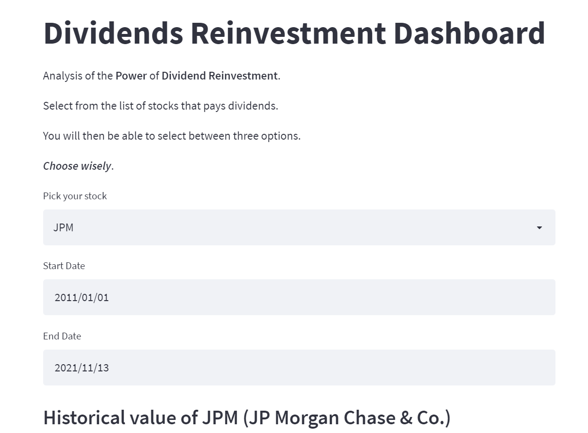
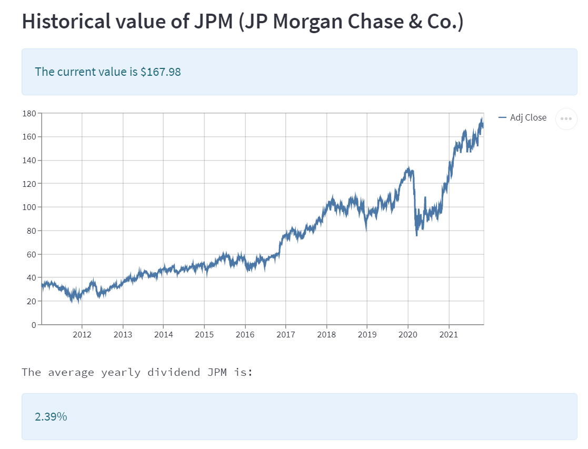
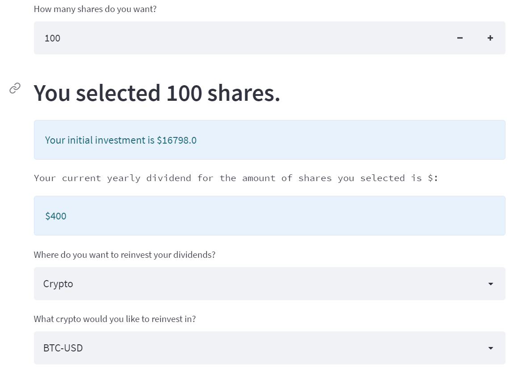
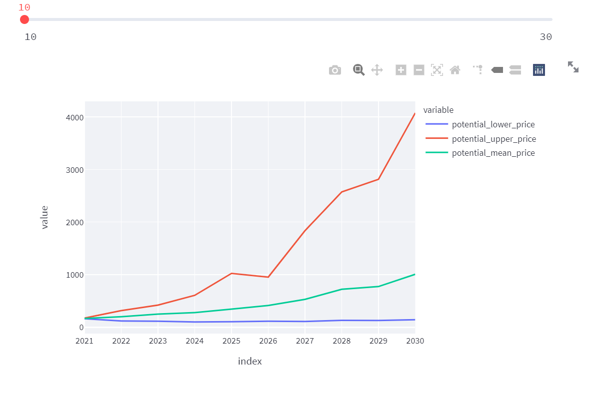
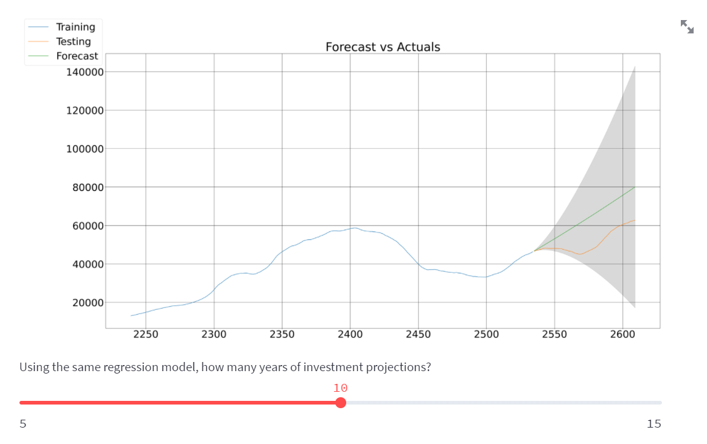
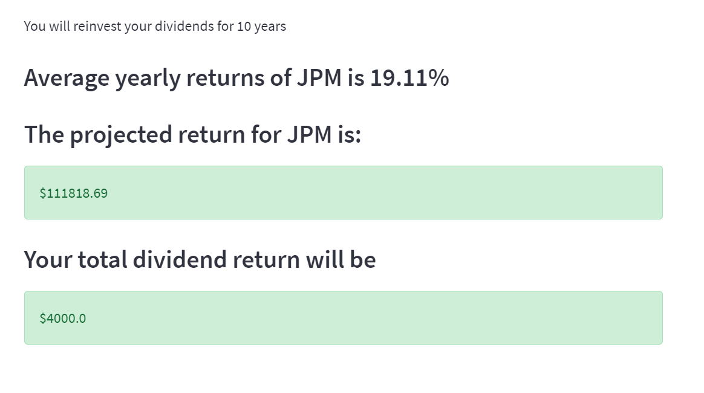
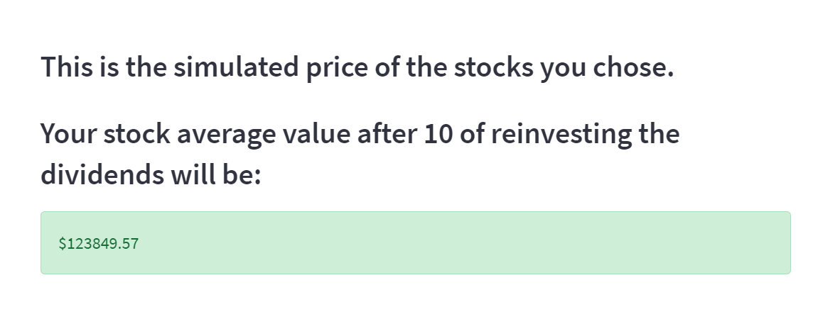
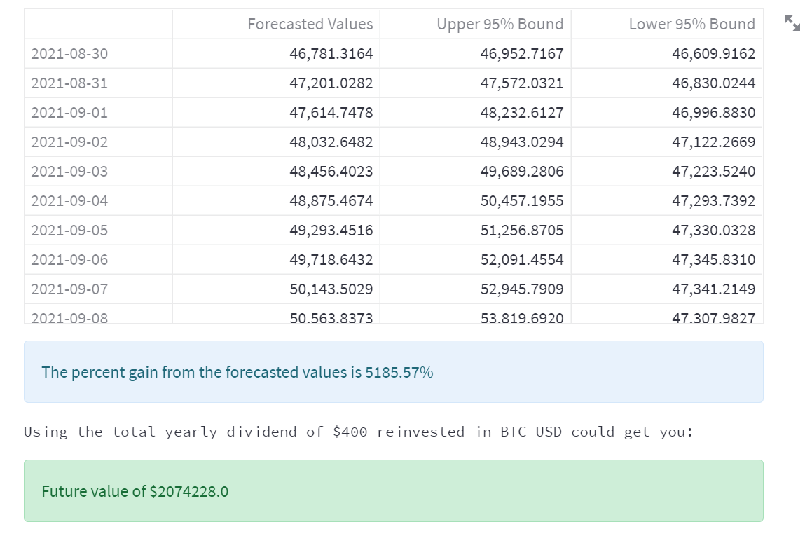

<!--- the header is made with: https://github.com/kyechan99/capsule-render -->

## Executive Summary

Citizens of the world during this pandemic have been forced to experience a new way of life. Whether it was remote learning, excessive zoom meetings or taking PCR tests to protect the ones we love, we all had to adjust the way we think, plan and act. 

Over time we learn that where there is change, there is opportunity. And as we reflect on the last three years, the S&P 500 has returned 31.5% in 2019,18.4% in 2020 and 26.67% thus far in 2021 with a mean of 14.5% over the last ten years. Historically, we’ve learned that dividends in a bull market represents 42% of that growth in a broader market. 

As enticing as those returns are, cryptocurrency has seen more impressive growth over that same period of time as investors feel more confident in the blockchain ecosystem. An example of this is Bitcoin, the largest of the cryptocurrencies. Bitcoin has had returns of 88% in 2019, 302% in 2020 and 130.39 in 2021 with a mean of 716.0% over the last ten years. Nonetheless, Investors are still apprehensive of investing in something they don’t understand.

As a result, we have created a new tool that allows investors to compare and contrast the power of dividend reinvesting. In our interactive application, the investor can simulate a purchase of x shares of a dividend paying stock and compare the results of three options. This app will give you the option of taking the cash dividend as income, reinvesting the dividends in the same stock or reinvesting the dividends in cryptocurrency. Please enjoy the experience and please choose wisely! 

---

## Technologies

This project leverages python 3.7, Streamlit, Yahoo Finance, SciPy, ARIMA and Statsmodels .

Go to your terminal or git bash and run conda activate dev to activate your conda dev environment. 
You will then install the following librarie(s) and module(s) to run in Python codes created.
    pip install streamlit
    pip install yahoo-finance
    pip install scipy
    pip install pmdarima
    pip install statsmodels

To ensure installation was complete, run the following...
    conda list streamlit
    conda list yahoo-finance
    conda list scipy
    conda list pmdarima
    conda list statsmodels
    
---

## Usage

Go to the Anaconda Prompt to launch JupyterLab by typing Jupyter Lab. To use this application simply clone the repository and run the main.py in you Jupyter Lab Notebook. Open the terminal and input streamlit run main.py or click on https://share.streamlit.io/stefimaz/side_projects/main.py to experience the app.

---

## Visualization

---

## Contributors

linkedin.com/in/stephane-masyn-35b16817a/
linkedin.com/in/andy-he-8015bb17a/
linkedin.com/in/abuhorayra-hossain-019099226
linkedin.com/in/john-sung-3675569

---

## License

MIT
